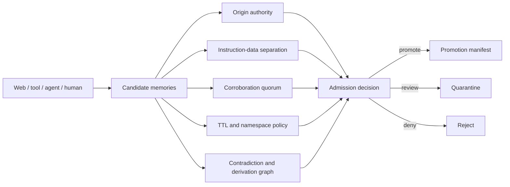

# ContextQuarantine

**A deterministic admission firewall for persistent AI-agent memory.**

Persistent memory turns a one-session mistake into durable behavior. ContextQuarantine inspects candidate memories before they cross that boundary. It separates instructions from data, isolates origin authority, requires independent corroboration for untrusted facts, preserves derivation taint, detects contradictions, limits retention, and compiles only approved records into a tamper-evident promotion manifest.

> Experimental security tool. It provides deterministic policy enforcement, not semantic truth or malware detection.

## The problem

A web page, tool output, session summary, or another agent can propose content that later gets stored as trusted memory. Once retrieved in a future session, malicious instructions and false facts may look indistinguishable from legitimate context.

Conventional prompt guards focus on the current model call. Memory databases focus on storing and retrieving context. ContextQuarantine governs the transition between them:

```text
untrusted context → candidate memory → admission policy → quarantine | durable memory
```

## What is new here

| Control | Behavior |
| --- | --- |
| Origin isolation | Every candidate carries an origin, trust level, and trust domain. |
| Instruction authority | Only explicitly listed origins may create durable instructions. |
| Corroboration quorum | Untrusted facts and decisions require agreement across independent origin domains. |
| Structured contradiction detection | Subject/predicate collisions with different values are quarantined. |
| Taint inheritance | Derived summaries inherit restrictive provenance instead of laundering it away. |
| TTL ceilings | Retention limits vary by trusted, bounded, and untrusted origins. |
| Namespace protection | Identity, authority, and credential memory can be restricted to trusted writers. |
| Policy regression diff | CI detects reduced corroboration, wider TTLs, new instruction writers, and disabled defenses. |
| Promotion manifest | Only clean candidates become SHA-256-bound portable records. |

Unlike a memory store, ContextQuarantine does not retrieve, rank, or embed memories. Unlike an LLM classifier, its verdict is local, deterministic, explainable, and reproducible.

## Quick start

Requires Node.js 20+ and pnpm 10.

```bash
pnpm install
pnpm check

# Fixtures use a fixed time for reproducible results.
pnpm contextq scan examples/safe-intake.json --at 2026-07-29T05:30:00.000Z

pnpm contextq promote examples/safe-intake.json \
  --at 2026-07-29T05:30:00.000Z \
  --output .context-quarantine/promotion.json

pnpm contextq verify .context-quarantine/promotion.json \
  --bundle examples/safe-intake.json
```

Expected safe result:

```text
ContextQuarantine · procurement-memory-intake
Status: CLEAN · 3 promote · 0 quarantine · 0 reject
```

Now inspect a poisoned intake:

```bash
pnpm contextq scan examples/poisoned-intake.json --at 2026-07-29T05:30:00.000Z
```

It is blocked for disguised instructions, secret persistence, protected-namespace access, insufficient corroboration, contradiction, and taint laundering.

## CLI

```text
context-quarantine scan <bundle.json> [--at <ISO date>] [--json]
context-quarantine explain <bundle.json> --candidate <id> [--at <ISO date>]
context-quarantine promote <bundle.json> --output <manifest.json> [--at <ISO date>]
context-quarantine verify <manifest.json> [--bundle <bundle.json>]
context-quarantine diff <previous-policy-or-bundle.json> <next-policy-or-bundle.json>
context-quarantine init [path]
```

Exit codes: `0` clean/valid, `2` blocked, `3` partial, `4` weakened policy, and `5` invalid input.

## Policy regression gate

```bash
pnpm contextq diff examples/safe-intake.json examples/weakened-policy.json
```

This exits `4` because the new policy reduces corroboration, grants a new origin instruction authority, removes protected namespaces, widens the untrusted TTL, and disables four defensive rules.

## Local Studio

```bash
pnpm dev
```

Open the printed URL. Switch between safe and adversarial fixtures, edit JSON, inspect every admission signal, and download a promotion manifest. Evaluation happens in the browser with no model calls, backend, telemetry, or API key.

## Memory admission model



Read [docs/MODEL.md](docs/MODEL.md) for the complete bundle format and [docs/POLICY.md](docs/POLICY.md) for rule semantics.

## Research context

The project responds to an emerging persistent-memory threat:

- [Bad Memory: Evaluating Prompt Injection Risks from Memory in Agentic Systems](https://arxiv.org/abs/2607.14611) reports that persistent memory changes the prompt-injection threat model.
- [From Untrusted Input to Trusted Memory](https://arxiv.org/abs/2606.04329) studies memory-poisoning attacks and gaps in existing prompt-injection defenses.
- [Hidden in Memory](https://arxiv.org/abs/2605.15338) studies sleeper poisoning that can reappear in later conversations.
- [Microsoft Security](https://www.microsoft.com/en-us/security/blog/2026/02/10/ai-recommendation-poisoning/) documents attempts to manipulate AI recommendations through poisoned information.

ContextQuarantine is an original experimental implementation of origin-domain corroboration, deterministic memory admission, derivation-taint inheritance, and policy-regression detection. Searches performed before publication found no exact GitHub repository or npm package named `ContextQuarantine`; this is not a legal or global uniqueness guarantee.

## Repository layout

```text
packages/core     Admission engine, hashing, manifest, verification, policy diff
packages/cli      Automation-friendly command-line interface
apps/studio       Local-first browser workbench
examples          Safe, poisoned, and weakened-policy fixtures
docs              Data model, policy, integration, and threat model
```

## Trust boundary

ContextQuarantine checks declared provenance and deterministic content signals. It does not authenticate origins, establish factual truth, execute decoded content, or replace sandboxing. Production systems should sign origin attestations, protect policy baselines, verify artifact bytes, and require human review for high-impact memory. See [SECURITY.md](SECURITY.md).

MIT licensed.
